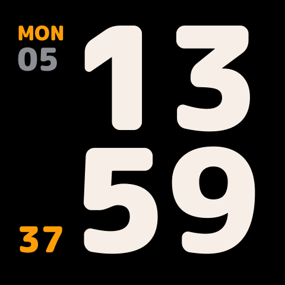
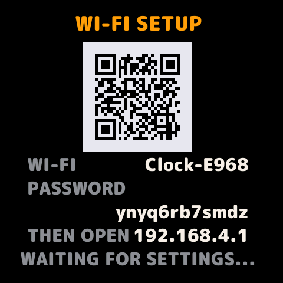
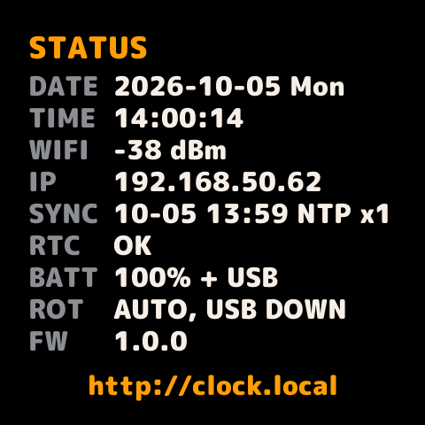

# ESP32 SimpleClock

[English](README.md)

**Waveshare ESP32-C6-Touch-AMOLED-2.16**（480 × 480 正方形 AMOLED）桌上型電子時鐘。上半部大字小時、下半部分鐘，兩列數字同欄對齊，秒數以小字放在角落。透過 Wi-Fi 自動網路對時（NTP），斷網時靠板載 RTC 繼續走時，並有多項措施減少 AMOLED 烙印。

| 偶數小時 | 奇數小時（側欄換到左邊） | Wi-Fi 設定 | 狀態頁（輕觸螢幕） |
|---|---|---|---|
|  |  |  |  |

以上截圖用 `tools/screenshot.py` 從實機讀回；狀態頁上的 Wi-Fi 名稱已遮蔽。

## 功能

- 時、分使用等寬數字，上下兩列逐欄對齊；秒數以小字放在分鐘旁的下角。
- 側欄上方顯示星期與日期。日期固定兩位數、固定字級，最寬的日期與「SUN」同寬；星期與日期都以實際字跡貼齊側欄外緣。12 小時制時加上 AM／PM。
- 每小時透過 NTP 對時，最多 3 個伺服器、可在網頁自行填寫（預設 `tock.stdtime.gov.tw`、`time.stdtime.gov.tw`、`pool.ntp.org`）。每次對時連問 4 次，取來回最快的那次並扣掉網路延遲，所以用電池時的 Wi-Fi 省電模式也不會讓時間跑掉。PCF85063 RTC 會跟著 NTP 保持準確，重新開機時先採用 RTC 的時間，所以沒有 Wi-Fi 也能正常走時。每次對時都會量測 RTC 的快慢並自動補償。
- 亮度 8 段，白天、夜間各自記憶；夜間時段自動調暗（預設 23:00–07:00）。
- 定時關閉螢幕（預設 03:00–09:00）：時段內螢幕關閉，按任一鍵或輕觸會亮 30 秒。
- 重力感應自動旋轉，或固定為某一方向。
- 防烙印：整個畫面每分鐘移動 1 像素，走 12 × 12 的封閉迴圈（位移 −6～+5 px）；側欄每小時左右換邊，大數字隨之移動 92 px；使用暖白色而非純白；夜間調暗；定時關閉。沒有有效時間（顯示「--」）時仍每分鐘移動、依開機時數每小時換邊；Wi-Fi 設定頁也會移動，10 分鐘沒有按鍵或輕觸就降到夜間亮度。
- 用手機設定 Wi-Fi：時鐘會開啟自己的熱點（12 字元隨機密碼）並在螢幕顯示 QR code，連上後設定頁自動跳出（captive portal）。
- 設定網頁 `http://clock.local`，可切換繁體中文／English（預設跟隨瀏覽器語言，右上角切換）。只接受從本頁送出的修改，其他網站無法代送。
- 提示：距上次對時超過 24 小時（或開機 5 分鐘內都沒有對時成功）顯示橘色 `SYNC`；只用電池且電量 15% 以下顯示紅色 `BATT`。

## 使用硬體

| 項目 | 說明 |
|---|---|
| 開發板 | [Waveshare ESP32-C6-Touch-AMOLED-2.16](https://docs.waveshare.com/ESP32-C6-Touch-AMOLED-2.16)（有無鋰電池版本皆可） |
| 主控 | ESP32-C6，RISC-V 160 MHz、512 KB SRAM、16 MB flash、無 PSRAM；Wi-Fi 6（僅 2.4 GHz） |
| 螢幕 | 2.16 吋 AMOLED，480 × 480，CO5300 控制器（QSPI） |
| 觸控 | CST9220（I²C） |
| 電源 | AXP2101：螢幕供電、PWR 鍵、電池充電 |
| RTC | PCF85063 |
| 姿態感測 | QMI8658（判斷方向） |
| 按鍵 | BOOT（GPIO 9）、KEY／IO10（GPIO 10）、PWR（經 AXP2101） |
| 線材 | 可傳資料的 USB-C 線 |

不需要焊接或其他零件。

## 按鍵

| 按鍵 | 短按 | 長按 |
|---|---|---|
| KEY（IO10） | 亮度 ＋ | 1.5 秒：切換方向（自動 → USB 朝下 → 左 → 上 → 右 → 自動） |
| BOOT | 亮度 － | 3 秒：進入／離開 Wi-Fi 設定 |
| PWR | 螢幕開／關 | 6 秒：整機關機（AXP2101 硬體行為；依 Waveshare 說明，短按 PWR 即可開機） |
| 輕觸螢幕 | 顯示狀態頁 10 秒（再點一次關閉） | — |

螢幕關閉時，第一次按鍵或輕觸只會喚醒螢幕。在定時關閉時段內，最後一次操作 30 秒後會再自動關閉。

## 編譯與燒錄

需要 Python 3（以 3.14 測試）與可傳資料的 USB-C 線。第一次編譯時 PlatformIO 會把工具鏈下載到 `~/.platformio`（測試機上約 7 GB），所需時間視網路而定。之後在測試機（Apple M4）上，從全新 clone 完整編譯 34–39 秒，小改動後重新編譯約 10 秒。

macOS／Linux：

```bash
git clone https://github.com/marvin3991/ESP32-SimpleClock.git
cd ESP32-SimpleClock
python3 -m venv .venv
.venv/bin/pip install -r requirements.txt
.venv/bin/pio run -t upload
```

Windows（PowerShell，未實測）：

```powershell
py -m venv .venv
.venv\Scripts\pip install -r requirements.txt
.venv\Scripts\pio run -t upload
```

- 連接埠會自動偵測；要指定時加上 `--upload-port /dev/cu.usbmodemXXXX`（Windows 為 `COM5` 之類）。
- 從 GitHub 下載很慢時，設定 `IDF_GITHUB_ASSETS=dl.espressif.com/github_assets`，編譯器會改從 Espressif 鏡像站下載。
- 選擇性：第一次燒錄前先備份原廠韌體（16 MB，約 1 分鐘）。`backup/` 已列入 `.gitignore`。

```bash
mkdir -p backup
~/.platformio/penv/bin/esptool --chip esp32c6 read-flash 0 0x1000000 backup/original-flash.bin
```

要還原時，把同一行指令的 `read-flash 0 0x1000000 backup/original-flash.bin` 換成 `write-flash 0 backup/original-flash.bin`。

## Wi-Fi 設定

以下兩種擇一，以最後一次修改的為準。

1. **`.env` 檔**：把 `.env.example` 複製成 `.env`，填入 `WIFI_SSID` 和 `WIFI_PASSWORD` 後重新燒錄。值含空白或 `#` 時用雙引號包起來；引號外「空白後的 `#`」之後視為註解。`.env` 不會進版控，`scripts/pio_env.py` 只會把它轉成 build 目錄裡的標頭檔。
2. **用手機**：沒有 Wi-Fi 設定且沒有有效時間時，時鐘會自動開啟設定熱點；其他時候長按 BOOT 3 秒。用手機相機掃螢幕上的 QR code 加入 `Clock-XXXX`（密碼每次隨機產生、12 個字元，顯示在螢幕上），設定頁會自動跳出；沒跳出就開 `http://192.168.4.1`。連線失敗時熱點會保留，方便修正設定。

連上家中網路後，設定頁在 `http://clock.local`（或狀態頁上顯示的 IP）。

## 設定網頁

可設定 Wi-Fi、時區、12／24 小時制、是否顯示日期、3 個對時伺服器、白天與夜間亮度、夜間時段、定時關閉時段、側欄每小時換邊、螢幕方向。網頁不會把已儲存的 Wi-Fi 密碼傳回瀏覽器；同一個區網內的任何人都能開啟這個頁面。

只接受從本頁送出的修改：頁面會附上其他網站無法加上的 `X-Clock` 標頭，時鐘的 API 也只回應指向 IP、不含點的名稱或 `clock.local` 這類區網專用名稱的請求（同時擋下 DNS rebinding）。請用 `http://clock.local` 或時鐘的 IP 開啟本頁。

## 序列埠指令與截圖

```bash
.venv/bin/python tools/console.py status
.venv/bin/python tools/screenshot.py shot.png
```

指令（輸入 `help` 查看）：`status`、`shot`、`btn boot|key|pwr|touch [short|long]`、`level <1-8>`、`rot auto|0|1|2|3`、`page clock|status|setup`、`settime <unix-epoch>`、`ntp`、`rtc`（RTC 時間、它跳秒時落在系統時鐘那一秒的哪裡，以及快慢補償值）、`imu`、`reboot`、`factory yes`。在 macOS／Linux 上工具會自動找連接埠；要指定時加上 `--port`。截圖資料結尾附 CRC-32，傳輸損壞時會自動重試。

## 測試

NTP 與計時邏輯有可以在電腦上跑的測試，不需要板子，只需要 C/C++ 編譯器與 bash：macOS 或 Linux（Windows 用 WSL）；目前只用 Apple clang 跑過。

```bash
tests/run.sh
```

- `tests/ntp_proto_test.cpp`：NTP 封包。包括跨 2036 年紀元的時間換算、偏移與延遲計算、誤差上限，以及應該拒收的回應（別的請求的回應、kiss-o'-death、伺服器本身未同步、格式錯誤或不可能的時間）。
- `tests/timekeep_sim.cpp`：讓 `src/timekeep.cpp` 在模擬環境中每個情境跑 72 小時。模擬的對象有 PCF85063（晶振誤差、Offset 補償脈衝、STOP 與放開）、會漂移的 ESP32 時鐘，以及來回延遲不對稱的 NTP 回應。17 個情境：晶振 −250～+60 ppm 與超出暫存器範圍的 −300 ppm、回應最多延遲 300 ms（Wi-Fi 省電）、每天擺動 ±3 ppm 的晶振、手動設定時間、NTP 與 Wi-Fi 中斷、伺服器回傳 2000 年、RTC 斷電。每個情境檢查最後的 Offset、改了幾次，以及 RTC 最多偏多少。

全部跑完只要幾秒，通過時最後一行是「host tests passed」（結束碼 0）；加 `-v` 會另外印出韌體的 log。NTP 背景任務本身（`src/ntp.cpp`：socket、DNS、計時）只能在板子上跑，實測數據見「規格」。

## 更換字型

數字與文字是由 TrueType 字型預先轉成點陣。要換字型：

```bash
.venv/bin/python tools/gen_fonts.py --ttf path/to/font.ttf --preview preview.png
.venv/bin/pio run -t upload
```

版面（欄寬、日期字級、位置）會依新字型重新計算。最大飄移時有字跡離螢幕邊緣不到 12 px，或數字、上下兩列、側欄文字會互相重疊時，產生器會報錯停止。公開前請確認字型授權。

## 規格

| 項目 | 數值 | 說明 |
|---|---|---|
| 字型 | M PLUS Rounded 1c Black | 時分字高 176 px、秒 44 px、星期 25 px、日期 39 px、介面文字 22 px；只含 ASCII |
| 版面 | 數字欄寬 159 px；基線 y = 225／431；側欄寬 80 px | 側欄在右時數字 x = 35，在左時 x = 127 |
| 日期 | 兩位等寬數字，每格 35 px；最寬的日期字跡 68 px | 「SUN」字跡 67 px；日期和星期一樣，以字跡貼齊側欄外緣 |
| 邊距 | 左 ≥ 29、右 30、上 40、下 41 px | 最大飄移、左右兩種排列、所有數字與標籤 |
| 繪圖 | 每次 480 × 32 px 一帶，只重畫變動區域 | ESP32-C6 沒有 PSRAM，放不下 450 KB 的整張畫面 |
| 對時 | NTP 每 3600 秒，自寫用戶端（RFC 5905）：依序找最多 3 個伺服器中第一個有回應的，間隔 2 秒問 4 次；來回最快的那次設定時鐘，偏移 ((t2 − t1) + (t3 − t4)) / 2 | 主機名稱或 IPv4（英數字、`.`、`-`，最長 63 字元）；三個都留空恢復預設。失敗後 30 秒重試，每次加倍，最長 10 分鐘。以 Mac 為基準強制對時 8 次：誤差範圍 3.4 ms，Wi-Fi 省電時 3.5 ms（原本的 lwIP SNTP，各 10 次：45 ms 與 115 ms） |
| RTC | PCF85063 存 UTC，RAM 位元組寫入標記 0xC7 | 沒有標記、振盪器停止旗標為 1、或時間早於韌體編譯日前一天時不採用 |
| RTC 寫入 | 按住 STOP 寫入，在 x.500 秒放開 | 這片板子的 RTC 在放開後 0.500 秒跳秒（規格書：0.507813–0.507935 秒）；寫入後跳秒落在系統時鐘整秒後 +1～+3 ms（`rtc` 指令實測）。有快慢補償時，跳秒位置還會每 4 分鐘擺動，每格 Offset 最多 1/1024 秒，因為補償脈衝集中在每第 4 分鐘的開頭、每秒一次（−21 實測：脈衝前 +17 ms、脈衝後 −2 ms）。誤差扣掉對時的誤差上限後仍達 100 ms、補償值改變，或量到不合理的快慢（扣掉雜訊仍超過 260 ppm）時才重寫 |
| RTC 快慢 | 每次 NTP 對時量測，與上次寫入後經過的時間比較 | 用 Offset 暫存器補償（快速模式，每格 4.069 ppm，每 4 分鐘套用）；快慢超過「半格＋兩次量測的不確定度」（補償脈衝、每次對時來回時間的一半、讀跳秒）才調整；手動設定的時間不當基準；補償值存在 NVS，RTC 斷電後會寫回（`factory yes` 會一併清掉，重開機後第二次 NTP 對時重新量測）。這片板子（韌體 log）：前 16 分鐘量到 −85.0 ppm（每天慢 7.3 秒）→ Offset −21；之後 1.04 小時量到 +2.4 ppm（每天快 0.2 秒） |
| 亮度 | 8 段：3、8、16、30、55、95、160、255（暫存器 0x51） | 最後一次調整 5 秒後才寫入 flash |
| 夜間調暗 | 預設 23:00–07:00 | 開始＝結束時停用；可跨午夜 |
| 定時關閉 | 預設啟用，03:00–09:00 | 只在時段開始／結束時切換；按鍵後亮 30 秒；Wi-Fi 設定中不關閉 |
| 方向 | QMI8658，傾斜 > 0.5 g 且持續 0.7 秒 | 平放時維持上一個方向 |
| Wi-Fi 重連 | 10 秒起，每次加倍，上限 5 分鐘 | 單次連線 30 秒沒有回應視為失敗 |
| Wi-Fi 省電 | 接 USB 時關閉，只用電池時開啟 | 讓 `clock.local` 即時回應 |
| 設定熱點 | `Clock-` + MAC 後 2 bytes，WPA2，12 字元隨機密碼（31 種字元，不含 0/o/1/l/i），192.168.4.1 | 連線成功 8 秒後關閉；已有 Wi-Fi 設定、且這次設定沒有嘗試連線時，10 分鐘沒有網頁請求才關閉 |
| 記憶體 | RAM 25.2%（82,592／327,680 B），flash 24.4%（1,601,768／6,553,600 B） | 2026-10-05，全新 clone、沒有 `.env` 時的編譯結果 |

## 出處

- 字型：**M PLUS Rounded 1c**，設計 Coji Morishita 與 M+ Fonts Project，© 2016 The Rounded M+ Project Authors，[SIL Open Font License 1.1](fonts/OFL.txt)（取自 [Google Fonts](https://github.com/google/fonts/tree/main/ofl/mplusrounded1c)）。
- QR code：Project Nayuki 的 [QR Code generator library](https://github.com/nayuki/QR-Code-generator)（MIT）。
- 編譯時使用的函式庫：Arduino-ESP32、ESP-IDF、pioarduino、GFX Library for Arduino、SensorLib、XPowersLib。
- 開發板腳位與螢幕初始化數值：Waveshare 官方文件、電路圖與範例。

完整清單與授權：[THIRD_PARTY_NOTICES.md](THIRD_PARTY_NOTICES.md)。

## 授權

程式碼採 [MIT 授權](LICENSE)。`fonts/` 內的字型，以及 `src/generated/` 內由它產生的點陣字，採 SIL Open Font License 1.1。
